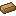

# Copper (銅)
> ### Tier 4

非常に入手のしやすい鉱石  
ツールとしての直接の使用ではなく、合金などの中間素材としての利用が想定される  
TConstructで既にマテリアルとしては追加されているが、鉱石などは実装されていないため、鉱石などを実装  
性能などはTConstructで既に追加されている

## 入手条件
鉱石を地下から採掘して入手
### 生成条件
| 種類 | 条件 |
| :--: | :---- |
| 対象ディメンション | どのディメンションでも生成 |
| 対象ブロック | Stone (石ブロック) |
| 高度 | 0 ~ 68 |
| 1チャンクの鉱脈生成量 | 16 |
| 1鉱脈の最大鉱石生成数 | 9 |

## 性能

### ヘッド
| ステータス名 | ステータス |
| :--: | :--- |
| 耐久力 | 210 |
| 採掘速度 | 5.30 |
| 攻撃力 | 3.00 |
| マイニングレベル | 鉄 |

### 持ち手
| ステータス名 | ステータス |
| :--: | :--- |
| 耐久補正値 | 1.05 |
| 耐久度 | 30 |

### エキストラパーツ
### 持ち手
| ステータス名 | ステータス |
| :--: | :--- |
| 耐久度 | 100 |

### 弓
| ステータス名 | ステータス |
| :--: | :--- |
| 引く速さ | 0.6 |
| 射程距離 | 1.45 |
| ボーナスダメージ | 5.00 |

## 性能 (Construct's Armory)

### コア
| ステータス名 | ステータス |
| :--: | :--- |
| 防御力 | 8 |
| 耐久度 | 12 |

### プレート
| ステータス名 | ステータス |
| :--: | :--- |
| 防具強度 | 0 |
| 耐久補正値 | 1.05 |
| 耐久度 | 2 |

### トリム
| ステータス名 | ステータス |
| :--: | :--- |
| 耐久度 | 8 |

## 特性
* 一級品
  * ブロックを破壊したときや、MOBからXPがドロップしたとき追加でXPがドロップする

## 特性 (Construct's Armory)
* Ambitious
  * ブロックを破壊したときや、MOBからXPがドロップしたとき追加でXPがドロップする?

## テクスチャ
> カラーコード: 忘れた  
> ガンマ補正値: 忘れた

| インゴット | 鉱石 | ブロック |
| :--: | :--: | :--: |
|  |  |  |