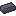

# Lead (鉛)
> ### Tier 4

非常に入手のしやすい鉱石  
ツールとしての直接の使用ではなく、合金などの中間素材としての利用が想定される  
TConstructで既にマテリアルとしては追加されているが、鉱石などは実装されていないため、鉱石などを実装  
性能などはTConstructで既に追加されている

## 入手条件
鉱石を地下から採掘して入手
### 生成条件
| 種類 | 条件 |
| :--: | :---- |
| 対象ディメンション | どのディメンションでも生成 |
| 対象ブロック | Stone (石ブロック) |
| 高度 | 1 ~ 70 |
| 1チャンクの鉱脈生成量 | 16 |
| 1鉱脈の最大鉱石生成数 | 6 |

## 性能

### ヘッド
| ステータス名 | ステータス |
| :--: | :--- |
| 耐久力 | 434 |
| 採掘速度 | 5.25 |
| 攻撃力 | 3.50 |
| マイニングレベル | 鉄 |

### 持ち手
| ステータス名 | ステータス |
| :--: | :--- |
| 耐久補正値 | 0.70 |
| 耐久度 | -50 |

### エキストラパーツ
### 持ち手
| ステータス名 | ステータス |
| :--: | :--- |
| 耐久度 | 100 |

### 弓
| ステータス名 | ステータス |
| :--: | :--- |
| 引く速さ | 0.4 |
| 射程距離 | 1.3 |
| ボーナスダメージ | 5.00 |

## 性能 (Construct's Armory)

### コア
| ステータス名 | ステータス |
| :--: | :--- |
| 防御力 | 11 |
| 耐久度 | 16 |

### プレート
| ステータス名 | ステータス |
| :--: | :--- |
| 防具強度 | 2 |
| 耐久補正値 | 0.7 |
| 耐久度 | -3.5 |

### トリム
| ステータス名 | ステータス |
| :--: | :--- |
| 耐久度 | 8 |

## 特性
* 有毒
  * 攻撃したMOBに毒を付与する
* 重い
  * ノックバック体制を得る

## 特性 (Construct's Armory)
* Heavy
  * ノックバック耐性を得る
* Shielding
  * 受ける魔法ダメージを減少させる

## テクスチャ
> カラーコード: #595d6e  
> ガンマ補正値: 20

| インゴット | 鉱石 | ブロック |
| :--: | :--: | :--: |
|  |  |  |